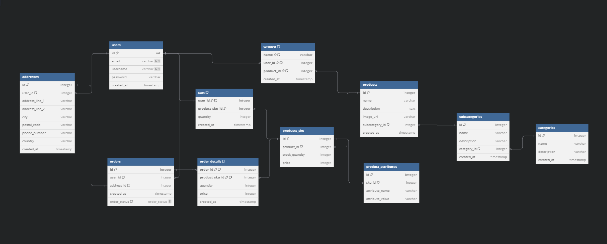

# e-commerce-rest-api
Build a fully-functioning e-commerce application REST API that allows users to perform various CRUD operations

## Features

- User authentication and management
- Product catalog with categories and subcategories
- Shopping cart and wishlist functionalities
- Order processing system

## Database Model

The database schema is designed to handle the core functionalities of the e-commerce platform. Below is an overview of the primary tables and their relationships:


[View schema](https://dbdiagram.io/d/E-commerce-67881c456b7fa355c303069e)


## Installation

1. Clone the repository:
```bash 
git clone https://github.com/martinbannister/e-commerce-rest-api.git
```
2. Navigate to the project directory:
```bash
cd e-commerce-rest-api
```
3. Install backend dependencies:
```bash
cd backend
```
```bash
npm install
```